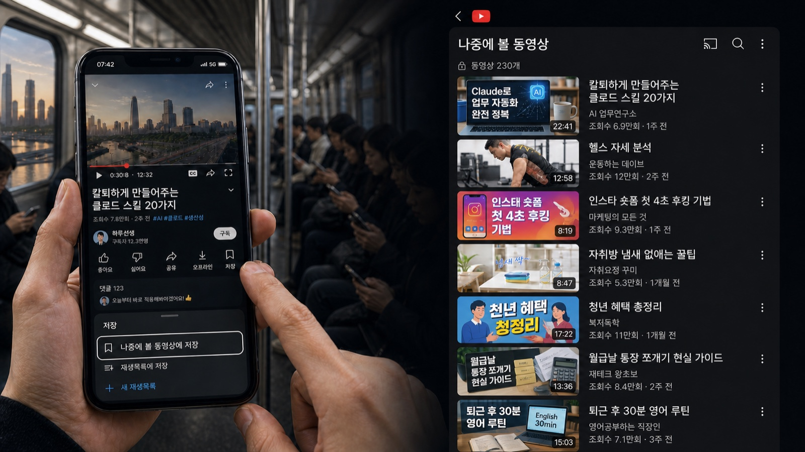
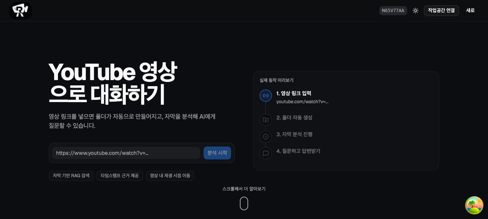

# “이 영상은 나중에 봐야지.” 그 나중은 언제인가요?

> **you talk는 저장한 YouTube 영상에서, 필요한 순간을 다시 찾고 근거와 함께 대화하게 합니다.**



## 저장한 영상은 많지만, 다시 찾기는 어렵습니다

출근길에 흥미로운 영상을 발견하면 우리는 쉽게 저장합니다. 하지만 나중에 다시 열어 보면 영상은 쌓여 있고, 어떤 내용이 어디에 있었는지 기억나지 않습니다.

- **저장하기는 쉽습니다.** 링크 하나면 목록에 추가됩니다.
- **다시 찾기는 어렵습니다.** 제목만으로는 필요한 내용을 구분하기 어렵습니다.
- **끝까지 보기에는 깁니다.** 원하는 설명 하나를 찾으려고 영상을 앞뒤로 돌려봐야 합니다.

**저장한 영상은 많지만, 다시 꺼내 쓸 수 있는 지식은 적습니다.**

## 그래서, you talk

you talk는 “나중에 볼 영상”을 **필요할 때 다시 질문할 수 있는 지식**으로 바꿉니다.

```text
영상 링크 또는 채널 연결
        ↓
필요한 영상만 선택 분석
        ↓
질문하면 답변 + 실제 영상 근거 + 시간 링크
```

영상 전체를 대신 요약해 주는 데서 끝나지 않습니다. 사용자가 궁금한 내용을 물으면 분석된 자막 안에서 관련 구간을 찾고, 답변이 나온 근거를 직접 확인할 수 있게 합니다.

## 서비스 미리보기



## 핵심 경험

| 경험 | 사용자가 얻는 것 |
| --- | --- |
| **찾기** | 링크, 채널, 재생목록으로 영상을 모으고 폴더별로 관리합니다. |
| **골라 분석하기** | 모든 영상을 무조건 깊게 분석하지 않고, 필요한 영상부터 분석합니다. |
| **질문하기** | 영상 내용을 기반으로 자연어 질문을 하고 답변을 받습니다. |
| **근거 확인하기** | 답변과 함께 실제 자막 구간, 타임스탬프, YouTube 시간 링크를 확인합니다. |
| **맥락 이어가기** | 영상별 대화를 분리해 다른 영상의 질문과 섞이지 않게 합니다. |
| **다시 활용하기** | 답변 듣기와 TXT/PDF 내보내기로 내용을 다시 활용합니다. |

## 우리가 지키는 방식

**모든 영상을 분석하는 대신, 먼저 탐색하고 필요한 영상만 깊게 분석합니다.**

채널과 영상의 metadata로 탐색 범위를 만들고, 선택한 영상만 자막·텍스트 분석·의미 검색까지 진행합니다. 이 방식은 긴 영상과 많은 영상 목록 사이에서 사용자가 필요한 답에 더 빨리 도착하도록 돕습니다.

## 프로젝트

- [서비스 열기](https://www.cs542.sth.ai.kr)
- [video-rag-mvp 소스 코드](https://github.com/ncp-ai-pro/video-rag-mvp)

`React` · `FastAPI` · `PostgreSQL` · `pgvector` · `Docker` · `NKS` · `CLOVA`
